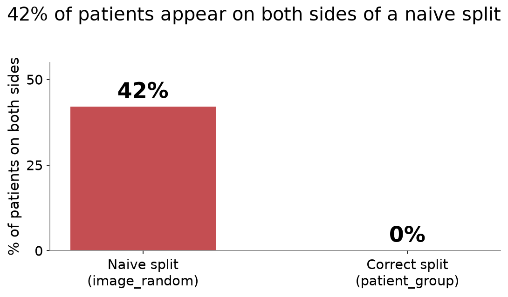
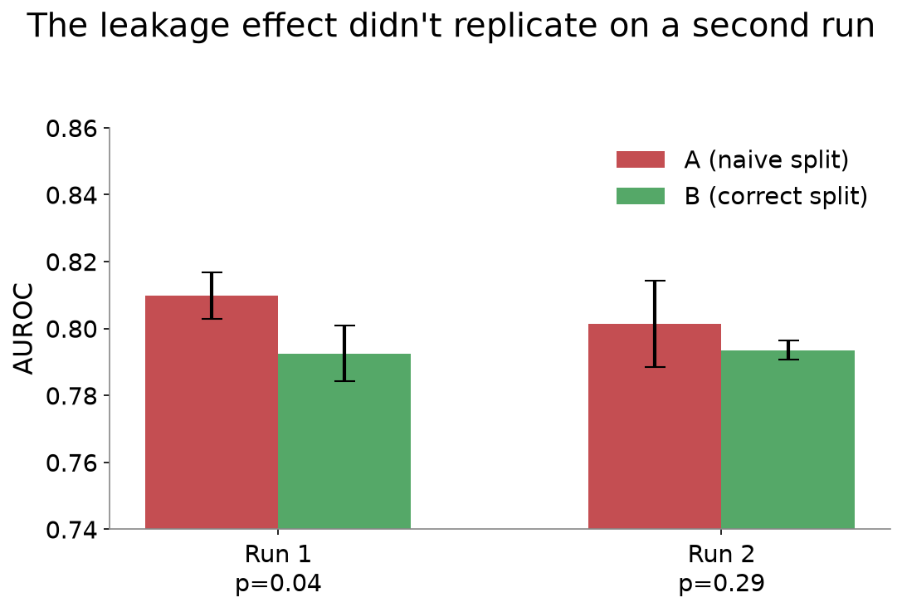
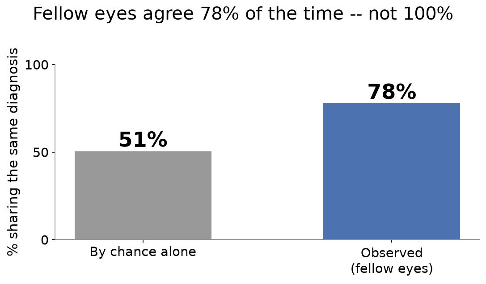
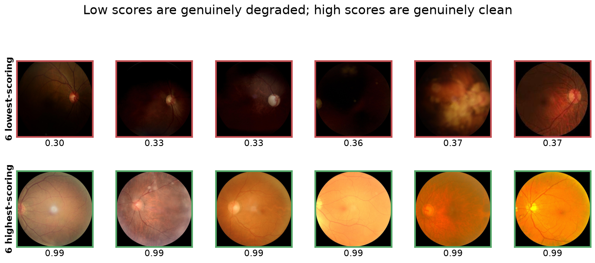

# RetinaPrep

Repository: retinal-dataset-audit · Package: retinaprep

**A curation and leakage-audit pipeline for retinal fundus datasets.**

This project's central finding is a hierarchy, not a single number:

- **Splitting by image leaks patients.** 42% of patients cross a naive
  train/test boundary — a model can partly be tested on patients it has
  already seen.
- **Splitting by patient — the standard fix — leaks sites instead.** A
  classifier recovers which clinic captured an image 84% of the time
  from the *preprocessed* photo alone, and site is entangled with
  diagnosis (p≈1e-15). Patient-grouping was never designed to catch
  this axis, so it doesn't.
- **Only splitting by site isolates the disease signal**, at a real,
  measured cost: AUROC drops by over 3x the original patient-level
  effect when entire sites are actually held out.

Each level of grouping is necessary and, on its own, insufficient for
the level above it. That is a more general and more useful claim than
"don't split by image," which is where this project started — the
patient-level leakage work below is the first rung, not the whole
story.

The model here is deliberately boring. The data path is the contribution.

**Live reports:** [combined QC & findings report](https://anurag-yadaviih.github.io/retinal-dataset-audit/qc_report.html)
(start here) &middot; [dataset EDA](https://anurag-yadaviih.github.io/retinal-dataset-audit/eda_report.html)
&middot; [leakage-findings charts](https://anurag-yadaviih.github.io/retinal-dataset-audit/findings_report.html).
Static snapshots as of this commit — see [Pipeline](#pipeline) below to
regenerate them from the real dataset.

---

## Rung 1: image-level splitting leaks patients

**42.0% of patients (1412/3358) land on both sides of a naive image-level
split.** That number is exact — it's a count, not a statistic, and needs no
significance test: under `image_random`, over 4 in 10 of the dataset's
patients have at least one eye in one fold and their fellow eye in another.
Grouped splitting (`patient_group`) eliminates this outright — 0 patients
cross a fold boundary, by construction, every time. This is the leakage the
rest of this section measures the downstream cost of — but it is rung one
of three; see "Cross-camera domain-shift audit" below for rungs two and
three.



Reproduce this exact number from a clean `artifacts/` directory with:
`python -m retinaprep ingest && python -m retinaprep split` (the checked-in
`configs/default.yaml` defaults — full dataset, `label.strategy: keywords`
— are what every number in this document was measured on; no override
needed). Verified byte-identical across two independent clean runs. An
earlier version of this document reported 42.3% (1422/3358) — that number
was computed under the now-superseded `normal_column` label strategy before
the switch to `keywords` (see the data card below); it was never re-derived
after the switch and was stale. `keywords` is this project's validated
default, so 42.0%/1412 is the correct, currently-reproducible figure.

### Downstream effect on a trained model (4 arms, 5 seeds, full dataset)

Four arms, same model and seeds throughout: **A** trains on the raw data with
the naive `image_random` split; **B** trains on the same raw data with the
correct `patient_group` split; **C** adds quality curation on top of B's
split; **D** adds deduplication on top of C. (Full definitions in the "All
four arms" table below.)

The single most honest result in this project: **the A-vs-B effect did not
replicate cleanly on a second run.**

| Run | AUROC diff (A−B) | p (uncorrected) | Sign consistency |
|---|---|---|---|
| First (A/B matched only against each other) | +0.0173 | 0.037 | 5/5 seeds |
| Second (A/B/C/D all matched together, size within 0.85% of the first) | +0.0079 | 0.29 | 3/5 seeds |



Same nominal seeds both times. The training-set size changed by under 1%
(matching against arms C/D, which didn't exist for the first run, pulled
the cap down slightly) — and that was enough to flip the result from
"significant, unanimous direction" to "not significant, majority but not
unanimous." Neither run's Bonferroni-corrected confidence interval ever
excluded zero. **This is not a settled result, and this project reports
both runs rather than the one that came out cleaner.** Full statistical
detail — including two rounds of self-correction on the first run's
analysis, and why re-running is more informative than a power calculation
— is in `docs/notes.md`.

### All four arms (before fix — kept for the record, see below)

| Arm | Data | Split | AUROC | AUPRC | Sens @ 95% Spec |
|---|---|---|---|---|---|
| A | raw | image-random | 0.8014 ± 0.0129 | 0.8512 ± 0.0117 | 0.4446 ± 0.0252 |
| B | raw | patient-grouped | 0.7936 ± 0.0028 | 0.8450 ± 0.0032 | 0.4207 ± 0.0176 |
| C | quality-curated | patient-grouped | 0.7790 ± 0.0044 | 0.8382 ± 0.0058 | 0.4248 ± 0.0284 |
| D | curated + deduplicated | patient-grouped | 0.7820 ± 0.0117 | 0.8404 ± 0.0086 | 0.4495 ± 0.0183 |

(Numbers above are the second, all-four-arms-matched run, sizes capped
to 4435 — the more methodologically correct design *for its time*,
since it caps every arm's training size against the smallest of all
four rather than just A and B. **A defect in this design was found and
fixed after these numbers were produced — see "The split-then-curate
fix" below before treating the C-vs-B row as settled.** Kept here in
full, unedited, because it's the evidence the fix was built to respond
to — not because it's still the recommended way to read this
comparison.)

**Predicted in writing, before running C and D**: 43 quality-rejected
images and at most 22 deduplicated images out of 6392 (0.7% and 0.3%)
can't plausibly move a metric with the seed-noise floor demonstrated
above — arms C and D were expected to be statistically indistinguishable
from B. **That held for D.** It did **not** fully hold for C: AUROC is
lower for C than B by a small amount (−0.0146), consistently across all
5/5 seeds, surviving Bonferroni correction across the 6-comparison family
— though only just (corrected CI upper bound −0.0002).

**Why, investigated rather than assumed — three hypotheses, tested in
order of confidence, and the flattering one lost:**

1. *Quality correlates with disease* (rejects are disproportionately
   abnormal, so curation strips positive cases) — **tested and refuted,
   in the opposite direction.** The 43 rejects are 62.8% normal against a
   45.0% dataset baseline (rejects skew *normal*, not abnormal;
   chi-square p=0.019), and across the full 6392-image dataset, abnormal
   images score very slightly *higher* quality on average, not lower
   (p=0.004). This hypothesis does not hold on this dataset.
2. *Composition, not size* — **tested and confirmed, and much larger
   than the raw removal count suggests.** B's and C's actual training
   sets, both exactly 4435 images, share only **69.2%** of those images
   — 1364 are simply different, because `patient_group_split` is
   recomputed fresh on each arm's curated pool and `StratifiedGroupKFold`
   reassigns a large fraction of fold membership from even a small
   change to its input.
3. *Magnitude sanity check* — **the "under 1%" framing was misleading.**
   Removing 43 *random* images (uncorrelated with quality) from the same
   pool and re-splitting produces 69.4% overlap with B's original
   training set — statistically indistinguishable from the real 69.2%.
   The actual perturbation this comparison measures is ~31% of the
   training set, not the 0.97% the raw count implies, which is why an
   effect this size is plausible at all.

**Revised leading explanation**: the C-vs-B difference is best explained
by `StratifiedGroupKFold`'s sensitivity to small input perturbations, not
by curation removing informative content — matching training-set *size*
across arms doesn't guarantee matching *identity* when the split is
recomputed per arm. This is a finding about this project's own
arm-comparison design as much as about ODIR-5K, and the original
"informative-but-hard-to-grade-images" hypothesis — plausible, and the
flattering account to have stopped at — does not survive the check.
Full detail for all three hypotheses is in `docs/notes.md`.

All arms use the same seed sequence, the same ResNet18 hyperparameters,
and training-set size matched across all four arms (not just within a
curation level) — the point being that if a curated arm's smaller natural
pool went uncapped, any difference from B would measure dataset size, not
curation.

### The split-then-curate fix, and the result after it

The composition finding above (B and C sharing only 69.2% of their
training images despite matched size) was a diagnosis, not a fix — the
defect causing it (`patient_group_split` recomputed fresh per arm)
stayed in the code. **Fixed in a later session**: split once on the raw
pool, then for curated arms *filter* that fixed split down to whichever
images survive curation, instead of recomputing — every surviving image
keeps its original fold, so the only variable between arms is which
images were removed. Config: `experiment.split_mode: persisted_base`
(new default; `recompute_per_arm` kept and selectable, since the table
above was produced with it). One deliberate consequence: **arm sizes are
no longer capped to a common size** — matching size was what forced the
defect in the first place, so under the fix the size difference between
arms *is* the treatment, not a confound.

**Verified before any retraining**: under the fix, C's and D's training
sets are provably subsets of B's — **100% overlap**, not 69.2%.

**Predicted in writing before re-running anything**: with ~43 images
removed and fold membership now stable, C-vs-B should show a much
smaller effect than the −0.0146 above, because most of that was
resampling, not curation.

**Re-ran all four arms, 5 seeds, full dataset, under the fix, natural
(uncapped) sizes:**

| Arm | Data | Split | N train | AUROC | AUPRC | Sens @ 95% Spec |
|---|---|---|---|---|---|---|
| A | raw | image-random | 4473 | 0.8098 ± 0.0069 | 0.8567 ± 0.0052 | 0.4554 ± 0.0262 |
| B | raw | patient-grouped | 4474 | 0.7915 ± 0.0099 | 0.8439 ± 0.0104 | 0.4327 ± 0.0304 |
| C | quality-curated | patient-grouped | 4446 | 0.7944 ± 0.0094 | 0.8462 ± 0.0076 | 0.4020 ± 0.0142 |
| D | curated + deduplicated | patient-grouped | 4436 | 0.7856 ± 0.0135 | 0.8395 ± 0.0083 | 0.4191 ± 0.0158 |

**The prediction held.** C-vs-B AUROC: **−0.0146 → +0.0029**. The one
comparison in this entire project that survived Bonferroni correction
(p=0.0078, 5/5 sign-consistent) has disappeared and flipped direction
(p=0.6160, 3/5) under the fix — nowhere close to significant. AUPRC
moves the same way (−0.0068 → +0.0023). D-vs-B stays a null both
before and after. This is the significant result, not a disappointing
one: a methodological artifact was diagnosed from indirect evidence
(the 69.2%/69.4% overlap numbers), a specific prediction was written
down before re-running anything, and the prediction held.

One new, honest, unconfirmed lead the fix surfaced: Sens@95%Spec now
shows a sign-consistent (5/5) *decrease* for C vs B (−0.0307,
p=0.0384 uncorrected) that does not survive Bonferroni correction —
reported as exactly that, an uncorrected signal worth more seeds, not
a finding. Full statistics (Bonferroni-adjusted CIs both before and
after, and a third A-vs-B measurement this run also produced) are in
`docs/notes.md`.

### Is the naive split unstable, not just optimistic? Investigated — inconclusive, reported that way

A second, independent-sounding argument for grouped splitting: arm A's
AUROC std in the second run is 0.0129 against arm B's 0.0028, a 4.6x
ratio — if the naive split's score depends on which patients happened to
straddle the fold boundary, it should be less *stable* across seeds, not
just optimistic on average. Checked against the first A/B run before
reporting it as a second confirmed finding, the same way the mean
difference was checked — **it does not hold up the same way in both
runs.** In the first run, A was actually *less* variable than B on AUROC
(0.0069 vs 0.0083) and AUPRC — the opposite direction — and only
sensitivity at 95% specificity showed A more variable (2.58x), which is
the metric showing the *weakest* version of the pattern in the second run
(1.43x). No single run's variance difference reaches conventional
significance (Levene's test, smallest p=0.081); an informal pooled
estimate across both runs (ratio ~1.8–2x for AUROC/AUPRC) is directionally
suggestive but still not significant (p=0.08–0.20) at this sample size.

**Reported honestly rather than promoted**: this does not clear the same
bar every other claim in this project has been held to. It's a suggestive,
unconfirmed lead — worth more seeds to resolve — not a second, independent,
replicated argument for grouped splitting alongside the (also unconfirmed)
mean-difference result. Full numbers for both runs are in `docs/notes.md`.

### Why the effect is smaller than the overlap suggests

42.0% patient overlap and a ~0.017 AUROC effect look like a mismatch until
you separate two different things: **patient overlap leaks the patient,
not the label.** Among 3034 multi-eye patients, fellow eyes share the same
binary (normal/abnormal) label only **77.8%** of the time — real
correlation (chance alone, at this dataset's 44.96%/55.04% class balance,
would give 50.5%), but nowhere near the ~100% that would make leaking a
patient equivalent to leaking their answer. For **22.2%** of multi-eye
patients, the fellow eye's label is actively uninformative — a
unilaterally-diseased patient's second eye is, correctly, often labelled
normal.



That 22.2% discordance dilutes the leakage ceiling directly: an
image-random split can make a fellow eye's *image* visible across the
train/test boundary, but it can only make the fellow eye's *label*
informative about 78% of the time. The measured effect being a modest
0.017 AUROC rather than something dramatic isn't a contradiction of the
42.0% overlap figure — it's what you'd expect once you account for what
the overlap actually hands the model. Full investigation, including two
other candidate explanations tested and a training-curve analysis, is in
`docs/notes.md`.

### Dataset integrity findings

Two things came out of investigating the effect size that are worth
stating on their own, independent of the A/B result:

**Eight genuine cross-patient duplicates exist in the raw data**, confirmed
by pixel difference near zero despite different file encoding — the same
photograph, filed under two different patient IDs, in every case: patients
352↔973, 398↔668, and 2487↔3185 (each duplicated on *both* eyes), plus
321↔1043, 3297↔4542, 31↔105, 1109↔1166, and 4330↔4552 (one eye each).
This is exactly why this pipeline needs both a grouped split *and* a
deduplication stage, not just one: **patient-grouped splitting cannot
catch this.** It only protects against a single declared patient ID
crossing a fold boundary — it has no way to know that two *different*
declared IDs are actually the same underlying capture. Only content-based
deduplication closes that gap. The money metric: of the 11 unique
verified duplicate pairs (8 by phash, 10 by embeddings, 7 found by
both), 3 straddle the `image_random` split's folds and 2 straddle
`patient_group`'s — materially the same order of magnitude for both,
confirming patient-grouping has no mechanism to catch this leak at all.

*(This count moved from an earlier estimate of 2 to 8 during the project's
own work, and the reason why is itself informative, not just a
correction: an initial ad hoc check only pixel-verified phash's tightest
sub-bucket — hamming distance exactly 0 — and found 2. The real dedupe
module verifies *every* phash candidate at the configured hamming≤6
threshold (13,733 of them) plus every embedding candidate, and found 8:
two real duplicates were sitting at phash hamming distance 1–6, invisible
to a hamming==0-only check, and three more were found only by the
embedding method, whose whole purpose is catching same-content pairs that
don't hash near-identically in the first place (different lighting/
exposure). Neither method alone would have found all 8 — see
`docs/notes.md` and `WALKTHROUGH.md` §7 for why both are necessary on this
modality, not just complementary in theory.)*

**Perceptual hashing (phash) is unreliable on fundus photography without
a tight, verified threshold.** At the naive default (`hamming<=6`), phash
flags 13,733 near-duplicate pairs across 6392 images — visually inspected,
and the overwhelming majority are false positives. Fundus photos share
enough generic macro-structure (dark background, circular field of view,
similar framing) that a coarse perceptual hash collapses unrelated images
together; this is a property of the imaging modality, not a bug in this
implementation. Even at the strictest possible bucket (`hamming==0`,
bit-identical hash), the overwhelming majority (12 of 14) of flagged pairs
were still false positives under direct pixel-difference verification — a
hash match alone is not sufficient evidence of duplication in this domain,
at any threshold, without a secondary check. Anyone building a dedupe step for
fundus (or likely other structurally-homogeneous medical imaging) data
should expect this and budget for verification, not just threshold
tuning.

---

## Rungs 2 and 3: cross-camera domain-shift audit, and site-level splitting

ODIR-5K mixes Canon, Zeiss and Kowa across several Chinese centres, with
no explicit camera/site column. Raw image resolution (before this
project's preprocessing resizes everything to a common 512x512) stands
in as a proxy — **stated once, applies throughout: this is a proxy for
camera, not the camera itself**, and under-counts real sites wherever
two cameras happen to share a resolution.

97 distinct raw resolutions, DBSCAN-clustered (eps=100px) into 43
groups, consolidated (groups under 50 images) into **20 final site
classes**. 99.0% of two-eye patients share an identical raw resolution
across both eyes — this proxy is overwhelmingly a per-patient property.

### Rung 2: patient-level splitting leaks sites instead

**The test that matters**: a ResNet18 trained on the *already-resized*
512x512 images (not the raw ones) to predict site, patient-grouped
split so a fellow eye can't hand it a shortcut. **Test accuracy 0.8397
against a 0.2932 majority baseline.** Since every image was already the
same size, this can't be about pixel dimensions — the signal survives
the resize this project's whole pipeline runs on. Checked directly, not
assumed: every one of the 20 site classes appears in all three folds
with roughly proportional representation (0.63–0.83 train-fraction,
target 0.70), so this result isn't fold structure masquerading as a
finding — see `docs/notes.md` for the full per-class table.

**Then, does site correlate with diagnosis?** Patient-level chi-square
against the genuinely patient-level `N` flag: **chi2=115.18,
p=8.8e-16.** Broken down by category, diabetic retinopathy,
hypertensive retinopathy, glaucoma, cataract, myopia, and "other" are
all highly significant (p<0.005); only age-related macular degeneration
is not (p=0.12).

### Rung 3: site-level splitting, arm E — the direct experiment

Diagnosis alone leaves a question open: how much does the site shortcut
actually cost a trained model? **Arm E** holds out entire sites
(`experiment.split_mode`'s persisted-split discipline, same as the
item-1 fix — `retinaprep split` persists `site_group.json` once).
Patient-level integrity comes free: since 99.0% of two-eye patients
share one site, grouping by site overwhelmingly keeps a patient's eyes
together too — though not perfectly (6 patients straddle a fold
boundary under `site_group`, vs 0 under `patient_group`; checked
directly, not assumed).

**A real caveat, stated before the result**: with only 20 groups and
one (`site_0`) holding 31% of the dataset, the val fold ended up being
a *single site* (402 images) and so did the test fold (1982 images) —
not one site dominating a mixed fold, but the fold *is* one site. Test
set class balance (63% abnormal) differs substantially from train's
(53%) as a direct, expected consequence of the entanglement just
measured, not a bug in the split.

**Predicted before running anything**: AUROC should drop substantially
relative to arm B — that drop is the site shortcut's price.

| Metric | E − B | p | Survives Bonferroni (3-test family) |
|---|---|---|---|
| AUROC | **−0.0557** | 0.0026 | **Yes** — Bonferroni CI excludes zero |
| AUPRC | +0.0023 | 0.706 | No |
| Sens@95%Spec | **−0.0585** | 0.0087 | **Yes** |

**The prediction held, decisively — the cleanest, most statistically
decisive result in this project.** AUROC drops over 3x the size of the
original patient-level effect, 5/5 seeds agreeing, surviving Bonferroni
correction with a confidence interval that excludes zero even after
correcting. AUPRC alone doesn't move, plausibly *because* — not despite
— the class-balance shift: AUPRC's precision baseline scales with test
prevalence, while AUROC and Sens@95%Spec (rank-based, prevalence-
insulated) both show the drop consistently. Predicted higher seed-to-
seed variance too; found a suggestive (1.96x) but not Levene-significant
ratio for AUROC, no support for Sens@95%Spec — reported as exactly
that, not rounded up to a confirmed finding.

**What this confirms**: patient-level splitting is necessary but not
sufficient — this is the direct, measured demonstration of that claim,
not just the statistical association behind it. Full statistics,
confusion matrix, and per-fold site/class-balance tables:
`docs/notes.md` and `WALKTHROUGH.md`.

---

## Why patient-level splitting matters in ophthalmology specifically

Two reasons that do not apply as strongly in other imaging domains:

1. **Two eyes, one patient.** Most ocular disease is bilateral and correlated.
   A model that has seen the left eye has, in effect, seen much of the right.
   Under an image-level random split, roughly half of every patient's data can
   sit in train while the fellow eye sits in test.
2. **Repeat captures.** Clinical archives contain the same eye photographed
   more than once in a session and across visits. Near-duplicates cross a
   random split silently.

The result is an optimistic score that will not survive contact with a new
clinic's data.

---

## Pipeline

```
ingest   -> canonical manifest (one row per eye)
quality  -> gradability score, reject list
dedupe   -> perceptual hash + embedding near-duplicates
split    -> image_random (wrong) vs patient_group (right)
train    -> ResNet18 binary normal/abnormal
experiment -> arms A/B/C/D, matched sizes
report   -> self-contained HTML QC report
```

---

## Data card

| field | value |
|---|---|
| Dataset | ODIR-5K (Ocular Disease Intelligent Recognition) |
| Source | Kaggle: `andrewmvd/ocular-disease-recognition-odir5k` |
| Collected by | Shanggong Medical Technology Co., Ltd., multiple centres in China |
| Size | ODIR-5K's nominal release is ~5,000 patients; this project's actual working set — `full_df.csv` joined against the images that exist in `preprocessed_images/` — has 3,358 patients (6,392 images). Roughly a third of the nominal patient count isn't present in the metadata/image files this project's adapter can resolve. That attrition is itself a curation fact worth stating plainly: every number in this document describes the 3,358-patient set, not the advertised ~5,000. |
| Cameras | Mixed (Canon, Zeiss, Kowa) — resolutions vary widely |
| Patient-level labels | N, D, G, C, A, H, M, O (8 classes) |
| Task here | Binary: normal vs abnormal |
| Licence | *Check the Kaggle page and record the exact terms here before publishing results.* |
| Known limitations | Class imbalance (55% abnormal under the default label rule); 324/3358 patients (9.6%) have only one usable eye in `preprocessed_images/`, so "two eyes per patient" cannot be assumed anywhere in the code; **camera/site confound across centres, confirmed not hypothetical** (chi2=115.18, p=8.8e-16 against diagnosis — see "Cross-camera domain-shift audit" below); annotation quality varies; **quality scoring does not reliably catch uniform haze** (dense cataract / severe media opacity) — two essentially featureless, uniformly hazy images score 0.943 and 0.979, near the top of the entire dataset (see below) |

At the extremes, the gradability score matches what these images actually
look like — a basic sanity check with no ground-truth quality labels to
validate against otherwise:



That said, the score has a real, specific blind spot away from the
extremes, described next.

**Quality scoring blind spot — uniform haze.** Two images with no visible
vessel or disc structure at all (consistent with dense cataract or severe
media opacity) score 0.943 and 0.979 out of 1.0 — among the highest scores
in the whole dataset. This isn't a blur or exposure failure, which is what
the current metrics measure: `illumination_uniformity` checks for *uneven*
illumination (one side dark, one side bright), and uniform haze is by
definition even, so it reads as good; the blur metrics (variance of
Laplacian, Tenengrad) stay above threshold because moderate haze doesn't
eliminate all high-frequency content — compression artifacts and faint
specular reflections still register even when the retinal structure a
clinician actually needs is gone. What's missing is a metric for *global
contrast* or vessel visibility specifically — a contrast/entropy-style
check, or a learned gradability classifier trained for exactly this
failure mode, is the natural next step; classical per-pixel/per-quadrant
statistics of the kind used here cannot structurally distinguish
"uniformly hazy" from "uniformly clear." Full investigation in
`docs/notes.md`.

**Label derivation rule:** `label.strategy: keywords` (default) parses the
per-eye `{Left,Right}-Diagnostic Keywords` string for the literal phrase
"normal fundus" — 2874/6392 rows (45.0%) normal. `normal_column` (the
patient-level `N` one-hot flag, both eyes forced to the same label) gives
2101/6392 (32.9%) normal; the two disagree on **12.1%** of rows.

**Why keywords, not normal_column — this was investigated, not assumed:**
`target`/`labels` (full_df.csv's other two columns, which look like they
should just be string-encodings of the patient-level N/D/G/.../O vector)
turned out **not** to be patient-level — they differ between a patient's
two eyes for 888/3034 multi-eye patients (29.3%), confirmed empirically
(`adapters/odir5k.py._report_label_locality`) rather than assumed. That
raised the question of which label source is actually right. Checking:

- `keywords` vs `target` agree on **100.0%** of all 6392 rows.
- Of the 675 patients where a target-derived label differs across eyes,
  `keywords` also differs for 674 (99.9%) — and the reverse holds too.
  Two independently-authored eye-level signals agreeing this precisely is
  strong evidence both are measuring the same real per-eye ground truth.
- Eyeballing 10 sampled normal_column-vs-keywords disagreements: all 10 are
  the same failure mode — a unilaterally-diseased patient (patient-level
  `N=0`) whose *other* eye carries the pathology, while this eye's own
  keyword string literally reads "normal fundus" (and `target` agrees).
  `normal_column` mislabels every one of these healthy fellow-eyes as
  abnormal — exactly the failure mode bilateral-disease correlation
  predicts, made concrete.

`keywords` is therefore the default; `normal_column` is retained,
selectable, and used as a comparison, not because it's a live candidate on
correctness grounds. The class-balance shift between the two (32.9% vs
45.0% normal) is itself a data-curation decision with a measurable effect
on the headline numbers, before curation or splitting are even in play —
which is exactly this project's thesis applied one layer earlier than
usual. Full investigation: `docs/notes.md`.

Images are **not** committed to this repository. See
[`scripts/download_data.sh`](scripts/download_data.sh).

---

## Environment setup

On Windows, use [`scripts/setup_env.ps1`](scripts/setup_env.ps1) rather than
the generic Quickstart below — it's documentation-as-script for exactly how
this project's dev environment is built, including the parts that are easy
to get wrong (torch is a separate, opt-in, 2-3 GB step; see
[Non-negotiable rules](CLAUDE.md) on staying CPU-first for everything except
`train`).

```powershell
# Anaconda users: run this first, however many envs are stacked.
conda deactivate

# Base env: .venv + requirements.txt (torch/torchvision excluded) + editable install.
.\scripts\setup_env.ps1

# When you're ready for GPU training (2-3 GB download, run on its own):
.\scripts\setup_env.ps1 -IncludeCudaTorch
```

Every command after this uses the venv's interpreter by **explicit path**,
not `activate` — a fresh shell doesn't inherit an activated venv, and this
project's own tooling was built assuming that:

```powershell
.\.venv\Scripts\python.exe -m pytest
.\.venv\Scripts\python.exe -m retinaprep ingest
```

Then check the environment itself with
[`scripts/doctor.py`](scripts/doctor.py) — Python version and interpreter
path, whether torch is installed and CUDA-capable, and (the check this
script exists for) whether the installed build actually still ships kernels
for this machine's GPU rather than merely reporting `cuda.is_available() ==
True`:

```powershell
.\.venv\Scripts\python.exe scripts\doctor.py
```

It exits non-zero only on a real problem (e.g. GPU kernels missing for this
card's compute capability, or a matmul that fails despite CUDA reporting
available) — torch being absent, or the raw dataset not being downloaded
yet, are both normal states it reports without failing.

---

## Quickstart

```bash
git clone https://github.com/Anurag-YadavIIH/retinal-dataset-audit.git
cd retinal-dataset-audit

python -m venv .venv && source .venv/bin/activate   # Windows: .venv\Scripts\activate
pip install -r requirements.txt
pip install -e .

bash scripts/download_data.sh          # needs a Kaggle API token, see the script

python -m retinaprep ingest
python -m retinaprep split
python -m retinaprep experiment --arm A
python -m retinaprep experiment --arm B
```

Override anything from the CLI:

```bash
python -m retinaprep train --set train.epochs=2 --set dataset.subsample_n=500
```

Run the tests, which need no dataset at all:

```bash
pytest
```

---

## Roadmap

Deliberately not built yet. Listed so the scope is honest rather than padded.

- [ ] U-Net optic disc and cup segmentation baseline (REFUGE, IDRiD)
- [ ] Mask and annotation QC: alignment, empty masks, area outliers, connected components
- [ ] Inter-grader agreement (Dice, IoU) using DRIVE's second-observer set
- [ ] DICOM PHI stripping and burned-in patient-text detection on the image itself
- [x] Cross-camera domain shift audit via a site classifier — done, see below
- [ ] EyePACS adapter to demonstrate the adapter layer generalises
- [x] Site-level splitting (arm E), motivated directly by the audit above — done, see "Rungs 2 and 3" above

---

## Repo layout

```
configs/default.yaml      every threshold and path
src/retinaprep/           the pipeline, one module per stage
  adapters/               one function per dataset
tests/                    synthetic fixtures, no download needed
scripts/download_data.sh  Kaggle fetch
artifacts/                all outputs (gitignored)
CLAUDE.md                 build instructions
WALKTHROUGH.md            design decisions + interview prep
```

---

## Author

Anurag Yadav — M.Tech Ophthalmic Engineering, IIT Hyderabad
[github.com/Anurag-YadavIIH](https://github.com/Anurag-YadavIIH)
