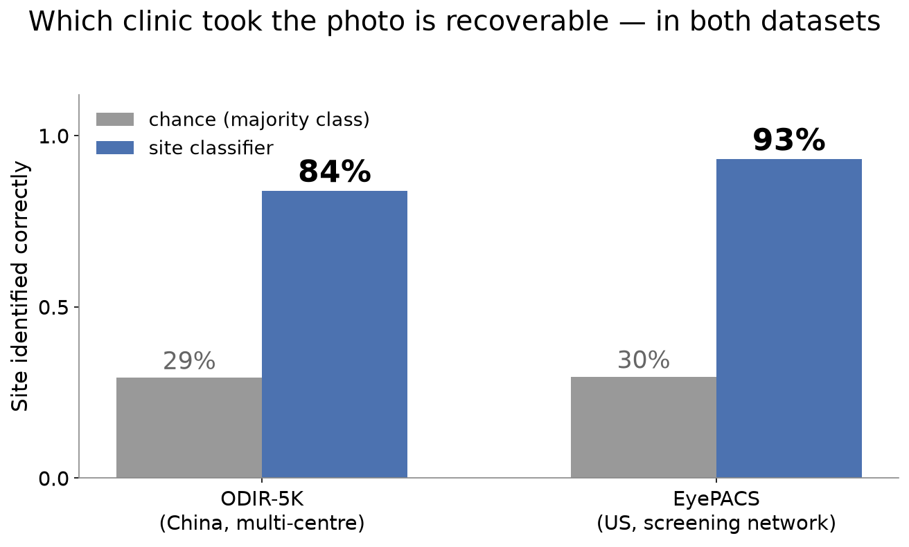
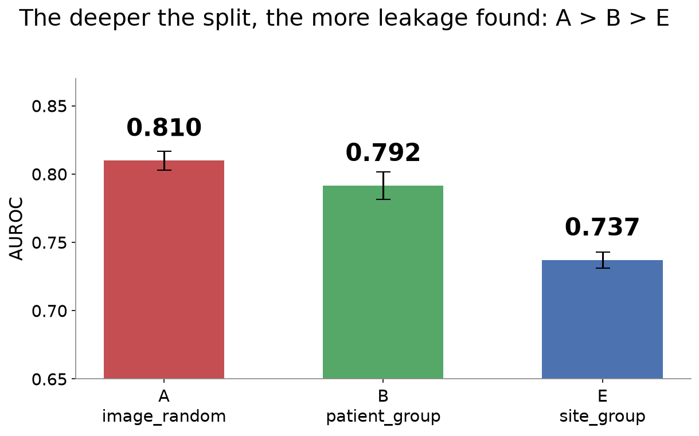
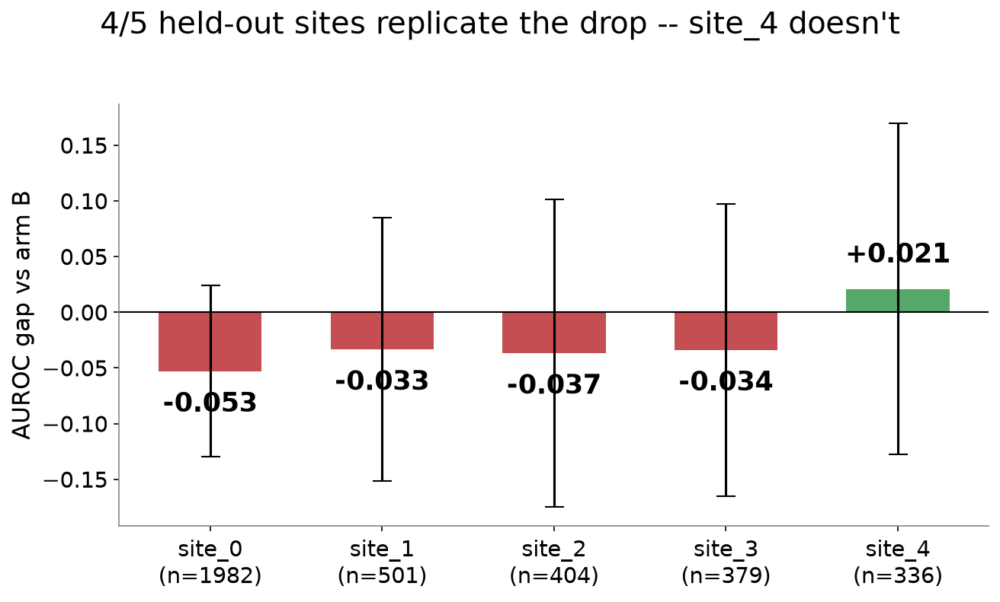
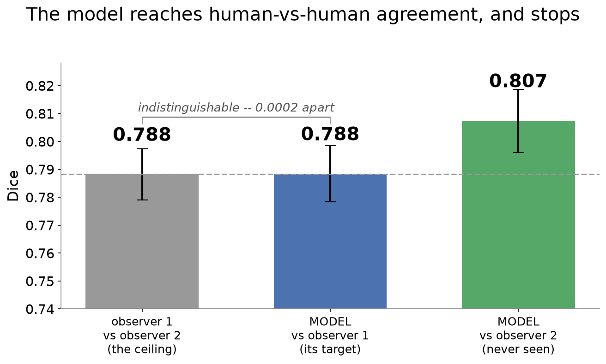

# RetinaPrep

Repository: retinal-dataset-audit · Package: retinaprep

**A curation and leakage-audit pipeline for retinal fundus datasets.**

## The argument

Fundus datasets leak at three levels, and **each level of protection is
insufficient for the next**:

| | The leak | ODIR-5K | EyePACS |
|---|---|---|---|
| **1** | Image-level splits leak **patients** | 42.0% of patients cross a fold<br>(46.5% of two-eye patients) | **45.9%** |
| **2** | Patient-level splits leak **sites** | site recoverable **84.0%** vs 29.3% baseline;<br>entangled with diagnosis χ²=115.2 | **93.2%** vs 29.6%;<br>χ²=139.6 |
| **3** | Neither catches **duplicated patients** | 11 pairs (**1.7/1,000**),<br>all 11 under two patient IDs<br>*whole dataset, n=6,392* | **444 pairs (69.5/1,000)**,<br>441 under two patient IDs<br>*subsample, n=6,392 of 35,126* |

Measured on two datasets from different continents, populations and
imaging programmes — ODIR-5K (6,392 images, multi-centre Chinese) and
EyePACS (35,126 images, a US telemedicine screening network). Everything
below is evidence for this argument.



The third row is the one to read twice. Patient-grouped splitting — the
standard fix, and the thing most papers mean by "we split properly" —
**cannot** catch a photograph filed under two different patient IDs,
because it only guarantees that one declared ID stays in one fold. In
EyePACS, 58% of duplicate clusters straddle a patient-grouped split
anyway.

**Where the argument is weaker than it sounds**, stated up front rather
than in a footnote:

- The downstream AUROC cost of level-1 leakage is **small and did not
  replicate cleanly** (+0.0173 then +0.0079 on a re-run; neither
  survives Bonferroni). The 42%/46% overlap is an exact count; the
  damage it does to a metric is not settled.
- "Site" is a **resolution-derived proxy**, not ground-truth camera
  metadata, in both datasets. It under-counts real sites wherever two
  cameras share a resolution.
- Level-2's measured cost (arm E, −0.0557 AUROC) survives
  prevalence-matching and replicates across 4 of 5 held-out sites, but
  **every individual site's confidence interval spans zero**, including
  the original.
- The duplicate counts are measured at **matched sample size** (6,392
  images each), so they are comparable to one another but are **not**
  EyePACS dataset totals — the full-dataset figure is higher and
  unmeasured, and does not scale linearly (candidate pairs grow
  quadratically). The finding shows contamination **exists**; it does
  not show that any specific published result was affected.

Running alongside all three levels rather than after them, **a fourth
strand asks what the labels those levels are measured against are
actually worth.** On two independent dual-graded datasets, qualified
human graders agree only ~78% (Dice) on where a retinal vessel is, and a
U-Net trained on one observer lands exactly at that agreement and stops —
see [the fourth strand](#the-fourth-strand-what-the-ground-truth-is-worth).

The model here is deliberately boring. The data path is the contribution.

**Live reports:** [combined QC & findings report](https://anurag-yadaviih.github.io/retinal-dataset-audit/qc_report.html)
(start here) &middot; [dataset EDA](https://anurag-yadaviih.github.io/retinal-dataset-audit/eda_report.html)
&middot; [leakage-findings charts](https://anurag-yadaviih.github.io/retinal-dataset-audit/findings_report.html).
Static snapshots as of this commit. **[docs/REPRODUCING.md](docs/REPRODUCING.md)
lists every headline number in this document with the exact command that
regenerates it, and marks the ones that cannot be regenerated** — read
that before trusting any figure here.

---

## The most reusable lesson: cross-dataset comparisons measure preprocessing history

This project made the same class of mistake twice, caught it twice, and
it generalises well beyond fundus imaging. **Any metric sensitive to
spatial frequency or aspect ratio compares preprocessing pipelines
unless you force both datasets through an identical path.**

**Instance 1 — a 24x quality gap that was really 2.3x.** EyePACS rejects
16.9% of images at this project's gradability threshold; ODIR-5K's
published rate is 0.7%. That reads as "EyePACS is dramatically worse
quality." But the two numbers describe images that reached 512×512 by
different routes: ODIR-5K's via whatever the Kaggle release shipped,
EyePACS's via a LANCZOS downscale from much larger originals. Pushing
ODIR-5K's *own raw images* through the identical LANCZOS path:

| condition | median gradability | reject rate |
|---|---|---|
| ODIR-5K as shipped | 0.879 | 0.7% |
| ODIR-5K raw → LANCZOS 512 | 0.740 | **7.4%** |
| EyePACS raw → LANCZOS 512 | 0.613 | 16.9% |

Its reject rate moved **10x with no change whatsoever to the
photographs**. The honest comparison is 2.3x, not 24x — roughly half the
apparent gap, on a log scale, was resize history. `variance_of_laplacian`
already carries a docstring warning about exactly this ("it ranks
cameras, not sharpness") and resizes internally to defend against it;
that defence cannot undo a resize that happened before the module was
called.

**Instance 2 — an aspect-ratio channel that would have faked the headline
result.** The site classifier must not be able to read source resolution
directly, or the whole experiment is circular. EyePACS ships native
images from 433×289 to 5184×3456; the training transform resizes to a
square 256×256, which squashes a 5184×3456 frame and a 2560×1920 frame
by *different* aspect-ratio factors. A network could recover "site" from
that distortion alone, with nothing to do with optics or colour
rendition. ODIR-5K avoided this for free, because its shipped images were
already square 512×512 — so the flaw only became visible when a second
dataset arrived. Fixed by normalising EyePACS to the same square 512×512
first, which is why `scripts/preprocess_eyepacs.py` exists.

**The general rule**: when comparing any image-quality, sharpness,
duplicate or domain metric across datasets, re-derive both from raw
originals through one pipeline you control. If you cannot, the
comparison is between pipelines, not datasets — and you should say so.

---

## Level 1: image-level splits leak patients

**42.0% of patients (1412/3358) land on both sides of a naive image-level
split.** That number is exact — it's a count, not a statistic, and needs no
significance test: under `image_random`, over 4 in 10 of the dataset's
patients have at least one eye in one fold and their fellow eye in another.
Grouped splitting (`patient_group`) eliminates this outright — 0 patients
cross a fold boundary, by construction, every time. This is the leakage the
rest of this section measures the downstream cost of — but it is level
one of three; see "Level 2" and "Level 3" below.


Reproduce this exact number from a clean `artifacts/` directory with:
`python -m retinaprep ingest && python -m retinaprep split` (the checked-in
`configs/default.yaml` defaults — full dataset, `label.strategy: keywords`
— are what every number in this document was measured on; no override
needed). Verified byte-identical across two independent clean runs. An
earlier version of this document reported 42.3% (1422/3358) — that number
was computed under the now-superseded `normal_column` label strategy before
the switch to `keywords` (see the data card below); it was never re-derived
after the switch and was stale. `keywords` is this project's validated
default, so 42.0%/1412 is the correct, currently-reproducible figure.

### Downstream effect on a trained model (4 arms, 5 seeds, full dataset)

Four arms, same model and seeds throughout: **A** trains on the raw data with
the naive `image_random` split; **B** trains on the same raw data with the
correct `patient_group` split; **C** adds quality curation on top of B's
split; **D** adds deduplication on top of C. (Full definitions in the "All
four arms" table below.)

The single most honest result in this project: **the A-vs-B effect did not
replicate cleanly on a second run.**

| Run | AUROC diff (A−B) | p (uncorrected) | Sign consistency |
|---|---|---|---|
| First (A/B matched only against each other) | +0.0173 | 0.037 | 5/5 seeds |
| Second (A/B/C/D all matched together, size within 0.85% of the first) | +0.0079 | 0.29 | 3/5 seeds |


Same nominal seeds both times. The training-set size changed by under 1%
(matching against arms C/D, which didn't exist for the first run, pulled
the cap down slightly) — and that was enough to flip the result from
"significant, unanimous direction" to "not significant, majority but not
unanimous." Neither run's Bonferroni-corrected confidence interval ever
excluded zero. **This is not a settled result, and this project reports
both runs rather than the one that came out cleaner.** Full statistical
detail — including two rounds of self-correction on the first run's
analysis, and why re-running is more informative than a power calculation
— is in `docs/notes.md`.

### All four arms (before fix — kept for the record, see below)

| Arm | Data | Split | AUROC | AUPRC | Sens @ 95% Spec |
|---|---|---|---|---|---|
| A | raw | image-random | 0.8014 ± 0.0129 | 0.8512 ± 0.0117 | 0.4446 ± 0.0252 |
| B | raw | patient-grouped | 0.7936 ± 0.0028 | 0.8450 ± 0.0032 | 0.4207 ± 0.0176 |
| C | quality-curated | patient-grouped | 0.7790 ± 0.0044 | 0.8382 ± 0.0058 | 0.4248 ± 0.0284 |
| D | curated + deduplicated | patient-grouped | 0.7820 ± 0.0117 | 0.8404 ± 0.0086 | 0.4495 ± 0.0183 |

(Numbers above are the second, all-four-arms-matched run, sizes capped
to 4435 — the more methodologically correct design *for its time*,
since it caps every arm's training size against the smallest of all
four rather than just A and B. **A defect in this design was found and
fixed after these numbers were produced — see "The split-then-curate
fix" below before treating the C-vs-B row as settled.** Kept here in
full, unedited, because it's the evidence the fix was built to respond
to — not because it's still the recommended way to read this
comparison.)

**Predicted in writing, before running C and D**: 43 quality-rejected
images and at most 22 deduplicated images out of 6392 (0.7% and 0.3%)
can't plausibly move a metric with the seed-noise floor demonstrated
above — arms C and D were expected to be statistically indistinguishable
from B. **That held for D.** It did **not** fully hold for C: AUROC is
lower for C than B by a small amount (−0.0146), consistently across all
5/5 seeds, surviving Bonferroni correction across the 6-comparison family
— though only just (corrected CI upper bound −0.0002).

**Why, investigated rather than assumed — three hypotheses, tested in
order of confidence, and the flattering one lost:**

1. *Quality correlates with disease* (rejects are disproportionately
   abnormal, so curation strips positive cases) — **tested and refuted,
   in the opposite direction.** The 43 rejects are 62.8% normal against a
   45.0% dataset baseline (rejects skew *normal*, not abnormal;
   chi-square p=0.019), and across the full 6392-image dataset, abnormal
   images score very slightly *higher* quality on average, not lower
   (p=0.004). This hypothesis does not hold on this dataset.
2. *Composition, not size* — **tested and confirmed, and much larger
   than the raw removal count suggests.** B's and C's actual training
   sets, both exactly 4435 images, share only **69.2%** of those images
   — 1364 are simply different, because `patient_group_split` is
   recomputed fresh on each arm's curated pool and `StratifiedGroupKFold`
   reassigns a large fraction of fold membership from even a small
   change to its input.
3. *Magnitude sanity check* — **the "under 1%" framing was misleading.**
   Removing 43 *random* images (uncorrelated with quality) from the same
   pool and re-splitting produces 69.4% overlap with B's original
   training set — statistically indistinguishable from the real 69.2%.
   The actual perturbation this comparison measures is ~31% of the
   training set, not the 0.97% the raw count implies, which is why an
   effect this size is plausible at all.

**Revised leading explanation**: the C-vs-B difference is best explained
by `StratifiedGroupKFold`'s sensitivity to small input perturbations, not
by curation removing informative content — matching training-set *size*
across arms doesn't guarantee matching *identity* when the split is
recomputed per arm. This is a finding about this project's own
arm-comparison design as much as about ODIR-5K, and the original
"informative-but-hard-to-grade-images" hypothesis — plausible, and the
flattering account to have stopped at — does not survive the check.
Full detail for all three hypotheses is in `docs/notes.md`.

All arms use the same seed sequence, the same ResNet18 hyperparameters,
and training-set size matched across all four arms (not just within a
curation level) — the point being that if a curated arm's smaller natural
pool went uncapped, any difference from B would measure dataset size, not
curation.

### The split-then-curate fix, and the result after it

The composition finding above (B and C sharing only 69.2% of their
training images despite matched size) was a diagnosis, not a fix — the
defect causing it (`patient_group_split` recomputed fresh per arm)
stayed in the code. **Fixed in a later session**: split once on the raw
pool, then for curated arms *filter* that fixed split down to whichever
images survive curation, instead of recomputing — every surviving image
keeps its original fold, so the only variable between arms is which
images were removed. Config: `experiment.split_mode: persisted_base`
(new default; `recompute_per_arm` kept and selectable, since the table
above was produced with it). One deliberate consequence: **arm sizes are
no longer capped to a common size** — matching size was what forced the
defect in the first place, so under the fix the size difference between
arms *is* the treatment, not a confound.

**Verified before any retraining**: under the fix, C's and D's training
sets are provably subsets of B's — **100% overlap**, not 69.2%.

**Predicted in writing before re-running anything**: with ~43 images
removed and fold membership now stable, C-vs-B should show a much
smaller effect than the −0.0146 above, because most of that was
resampling, not curation.

**Re-ran all four arms, 5 seeds, full dataset, under the fix, natural
(uncapped) sizes:**

| Arm | Data | Split | N train | AUROC | AUPRC | Sens @ 95% Spec |
|---|---|---|---|---|---|---|
| A | raw | image-random | 4473 | 0.8098 ± 0.0069 | 0.8567 ± 0.0052 | 0.4554 ± 0.0262 |
| B | raw | patient-grouped | 4474 | 0.7915 ± 0.0099 | 0.8439 ± 0.0104 | 0.4327 ± 0.0304 |
| C | quality-curated | patient-grouped | 4446 | 0.7944 ± 0.0094 | 0.8462 ± 0.0076 | 0.4020 ± 0.0142 |
| D | curated + deduplicated | patient-grouped | 4436 | 0.7856 ± 0.0135 | 0.8395 ± 0.0083 | 0.4191 ± 0.0158 |

**The prediction held.** C-vs-B AUROC: **−0.0146 → +0.0029**. The one
comparison in this entire project that survived Bonferroni correction
(p=0.0078, 5/5 sign-consistent) has disappeared and flipped direction
(p=0.6160, 3/5) under the fix — nowhere close to significant. AUPRC
moves the same way (−0.0068 → +0.0023). D-vs-B stays a null both
before and after. This is the significant result, not a disappointing
one: a methodological artifact was diagnosed from indirect evidence
(the 69.2%/69.4% overlap numbers), a specific prediction was written
down before re-running anything, and the prediction held.

One new, honest, unconfirmed lead the fix surfaced: Sens@95%Spec now
shows a sign-consistent (5/5) *decrease* for C vs B (−0.0307,
p=0.0384 uncorrected) that does not survive Bonferroni correction —
reported as exactly that, an uncorrected signal worth more seeds, not
a finding. Full statistics (Bonferroni-adjusted CIs both before and
after, and a third A-vs-B measurement this run also produced) are in
`docs/notes.md`.

### Is the naive split unstable, not just optimistic? Investigated — inconclusive, reported that way

A second, independent-sounding argument for grouped splitting: arm A's
AUROC std in the second run is 0.0129 against arm B's 0.0028, a 4.6x
ratio — if the naive split's score depends on which patients happened to
straddle the fold boundary, it should be less *stable* across seeds, not
just optimistic on average. Checked against the first A/B run before
reporting it as a second confirmed finding, the same way the mean
difference was checked — **it does not hold up the same way in both
runs.** In the first run, A was actually *less* variable than B on AUROC
(0.0069 vs 0.0083) and AUPRC — the opposite direction — and only
sensitivity at 95% specificity showed A more variable (2.58x), which is
the metric showing the *weakest* version of the pattern in the second run
(1.43x). No single run's variance difference reaches conventional
significance (Levene's test, smallest p=0.081); an informal pooled
estimate across both runs (ratio ~1.8–2x for AUROC/AUPRC) is directionally
suggestive but still not significant (p=0.08–0.20) at this sample size.

**Reported honestly rather than promoted**: this does not clear the same
bar every other claim in this project has been held to. It's a suggestive,
unconfirmed lead — worth more seeds to resolve — not a second, independent,
replicated argument for grouped splitting alongside the (also unconfirmed)
mean-difference result. Full numbers for both runs are in `docs/notes.md`.

### Why the effect is smaller than the overlap suggests

42.0% patient overlap and a ~0.017 AUROC effect look like a mismatch until
you separate two different things: **patient overlap leaks the patient,
not the label.** Among 3034 multi-eye patients, fellow eyes share the same
binary (normal/abnormal) label only **77.8%** of the time — real
correlation (chance alone, at this dataset's 44.96%/55.04% class balance,
would give 50.5%), but nowhere near the ~100% that would make leaking a
patient equivalent to leaking their answer. For **22.2%** of multi-eye
patients, the fellow eye's label is actively uninformative — a
unilaterally-diseased patient's second eye is, correctly, often labelled
normal.


That 22.2% discordance dilutes the leakage ceiling directly: an
image-random split can make a fellow eye's *image* visible across the
train/test boundary, but it can only make the fellow eye's *label*
informative about 78% of the time. The measured effect being a modest
0.017 AUROC rather than something dramatic isn't a contradiction of the
42.0% overlap figure — it's what you'd expect once you account for what
the overlap actually hands the model. Full investigation, including two
other candidate explanations tested and a training-curve analysis, is in
`docs/notes.md`.

---

## Level 2: patient-level splits leak sites

ODIR-5K mixes Canon, Zeiss and Kowa across several Chinese centres, with
no explicit camera/site column. Raw image resolution (before this
project's preprocessing resizes everything to a common 512x512) stands
in as a proxy — **stated once, applies throughout: this is a proxy for
camera, not the camera itself**, and under-counts real sites wherever
two cameras happen to share a resolution.

97 distinct raw resolutions, DBSCAN-clustered (eps=100px) into 43
groups, consolidated (groups under 50 images) into **20 final site
classes**. 99.0% of two-eye patients share an identical raw resolution
across both eyes — this proxy is overwhelmingly a per-patient property.

### The audit: is site recoverable at all?

**The test that matters**: a ResNet18 trained on the *already-resized*
512x512 images (not the raw ones) to predict site, patient-grouped
split so a fellow eye can't hand it a shortcut. **Test accuracy 0.8397
against a 0.2932 majority baseline.** Since every image was already the
same size, this can't be about pixel dimensions — the signal survives
the resize this project's whole pipeline runs on. Checked directly, not
assumed: every one of the 20 site classes appears in all three folds
with roughly proportional representation (0.63–0.83 train-fraction,
target 0.70), so this result isn't fold structure masquerading as a
finding — see `docs/notes.md` for the full per-class table.

**Then, does site correlate with diagnosis?** Patient-level chi-square
against the genuinely patient-level `N` flag: **chi2=115.18,
p=8.8e-16.** Broken down by category, diabetic retinopathy,
hypertensive retinopathy, glaucoma, cataract, myopia, and "other" are
all highly significant (p<0.005); only age-related macular degeneration
is not (p=0.12).

### What it costs: arm E, the direct experiment

Diagnosis alone leaves a question open: how much does the site shortcut
actually cost a trained model? **Arm E** holds out entire sites
(`experiment.split_mode`'s persisted-split discipline, same as the
item-1 fix — `retinaprep split` persists `site_group.json` once).
Patient-level integrity comes free: since 99.0% of two-eye patients
share one site, grouping by site overwhelmingly keeps a patient's eyes
together too — though not perfectly (6 patients straddle a fold
boundary under `site_group`, vs 0 under `patient_group`; checked
directly, not assumed — **fixed below, see "Robustness checks"**).

**A real caveat, stated before the result**: with only 20 groups and
one (`site_0`) holding 31% of the dataset, the val fold ended up being
a *single site* (402 images) and so did the test fold (1982 images) —
not one site dominating a mixed fold, but the fold *is* one site. Test
set class balance (63% abnormal) differs substantially from train's
(53%) as a direct, expected consequence of the entanglement just
measured, not a bug in the split.

**Predicted before running anything**: AUROC should drop substantially
relative to arm B — that drop is the site shortcut's price.

| Metric | E − B | p | Survives Bonferroni (3-test family) |
|---|---|---|---|
| AUROC | **−0.0557** | 0.0026 | **Yes** — Bonferroni CI excludes zero |
| AUPRC | +0.0023 | 0.706 | No |
| Sens@95%Spec | **−0.0585** | 0.0087 | **Yes** |

**The prediction held, decisively — the cleanest, most statistically
decisive result in this project.** AUROC drops over 3x the size of the
original patient-level effect, 5/5 seeds agreeing, surviving Bonferroni
correction with a confidence interval that excludes zero even after
correcting. AUPRC alone doesn't move, plausibly *because* — not despite
— the class-balance shift: AUPRC's precision baseline scales with test
prevalence, while AUROC and Sens@95%Spec (rank-based, prevalence-
insulated) both show the drop consistently. Predicted higher seed-to-
seed variance too; found a suggestive (1.96x) but not Levene-significant
ratio for AUROC, no support for Sens@95%Spec — reported as exactly
that, not rounded up to a confirmed finding.

**What this confirms**: patient-level splitting is necessary but not
sufficient — this is the direct, measured demonstration of that claim,
not just the statistical association behind it. Full statistics,
confusion matrix, and per-fold site/class-balance tables:
`docs/notes.md` and `WALKTHROUGH.md`.



### Robustness checks: is −0.0557 a prevalence artifact, or one site's fluke?

Arm E's headline number carried two open confounds: its test set's class
balance differs from B's (63% vs 55% abnormal), and its test fold *is* a
single site — one observation, not a distribution. Checked directly.

**The 6 straddling patients, fixed.** Verified the mechanism: 10 patients
(not just the 6 that crossed a fold) really do have two eyes at different
raw resolutions. `enforce_patient_site_consistency` assigns each
patient's pair to their majority label — 10 images reassigned, 0 patients
left inconsistent, patient overlap on the re-split now **0/0/0**. Effect
on the split: train 4008→4006, val 402→404 — **arm E's test fold itself
is untouched, same site, same 1982 images.**

**Prevalence-matched re-evaluation** (retrained B and E, 5 seeds, to get
per-example predictions the original runs never saved): the AUROC gap at
B's own 55% prevalence, at E's own 63%, and at each subsampled to match
the other, all land in a **0.0032-wide band** (−0.0514 to −0.0546) —
under 6% of the gap's own size. **Survives prevalence-matching in both
directions, essentially unchanged. Not a prevalence artifact.**

**Leave-one-site-out**, across the 4 next-largest sites (`Other`
excluded — a merged bucket, not a real site), 3 seeds each:

| Held-out site | n_test | abnormal frac | gap vs B |
|---|---|---|---|
| site_0 (the original arm E fold) | 1982 | 0.630 | **−0.0529** |
| site_1 | 501 | 0.489 | **−0.0334** |
| site_2 | 404 | 0.384 | **−0.0368** |
| site_3 | 379 | 0.491 | **−0.0339** |
| site_4 | 336 | 0.452 | **+0.0208** |



*Three numbers for arm E's gap appear in this document and they are not
inconsistent: **−0.0557** is the headline 5-seed run, **−0.0545** is the
5-seed retrain that saved per-example predictions for prevalence-matching,
and **−0.0529** is site_0 under the 3-seed leave-one-site-out sweep. The
fold sizes in the table above are also post-`enforce_patient_site_
consistency`, so site_1/2/4 read 501/404/336 where the pre-fix
`domain_shift_audit.json` has 499/402/335.*

4 of 5 held-out sites replicate the direction — not just the one site
that happened to land in the original split. **site_4 is a genuine,
unexplained exception** (consistent across all 3 of its own seeds, so
not a training fluke; its class balance doesn't explain it either, being
unremarkable next to two sites that *do* show the drop). With only 5
site-level observations this doesn't clear a two-sided significance
threshold alone (t-test p=0.096, sign test p=0.375) — reported as found,
not smoothed over: **generalizes across most held-out sites, not all of
them.** Full per-seed numbers: `docs/notes.md`.

**Two more checks on site_4.** A confidence interval per site that
accounts for test-*fold* size (not just seed variance — closed-form
Hanley-McNeil SE from each fold's fixed positive/negative counts, no
retraining needed) shows **every site's interval spans zero, including
the original site_0** — with one fold's worth of images per site, no
single site's number is precise enough alone to rule out zero. This
doesn't undo the 5-seed Bonferroni result (that answers "does this
reproduce across models on the *same* fold" — yes, still true) but it
does mean no individual site's gap should be read as a precise,
population-level estimate on its own. Second: does distance from the
training distribution (mean pairwise cosine distance, pretrained ResNet18
features — the same extraction `dedupe.py` uses) explain site_4?
Predicted it would be closest to training; **it isn't** — it's tied for
farthest, and site_0 (the largest loss) is second-closest, backwards
from the hypothesis (Pearson r=+0.40, p=0.50, wrong-signed and
untestable at n=5). site_4 stays an unexplained exception.

---

## Level 3: neither split catches duplicated patients

Both levels above protect against a *declared* patient ID crossing a fold
boundary. Neither has any mechanism to notice that two **different**
declared IDs hold the same underlying photograph. Only content-based
deduplication closes that gap.

### The comparison, with denominators

**Read the denominators before the counts.** ODIR-5K's numbers cover its
entire dataset. EyePACS's cover a patient-grouped subsample drawn to
ODIR-5K's exact size, so the two are measured at identical scale — the
EyePACS figures are *not* dataset totals.

| | ODIR-5K | EyePACS |
|---|---|---|
| Images scanned | 6,392 (**whole dataset**) | 6,392 (**subsample of 35,126**) |
| Verified duplicate pairs | 11 | **444** |
| — per 1,000 images | 1.7 | **69.5** |
| Same image under two *different* patient IDs | 11 (all of them) | **441** |
| — per 1,000 images | 1.7 | **69.0** |
| Duplicate clusters | 11 | 118 |
| Clusters straddling `patient_group` | 2 (18%) | **68 (58%)** |

**A units note, because an earlier version of this table got it wrong.**
Every row counts *image pairs*. ODIR-5K's 11 pairs span only **8 distinct
patient pairs**, because three of those patient pairs are duplicated on
*both* eyes (352↔973, 398↔668, 2487↔3185) — and earlier drafts put that
8 in the cross-patient row beside EyePACS's 441, which counts pairs. That
silently compared patient pairs against image pairs and flattered ODIR-5K.
Counted consistently, **all 11 of ODIR-5K's duplicate pairs are
cross-patient**, so its two rates are identical at 1.7 per 1,000.

At matched scale, EyePACS carries roughly **40x the duplicate rate** —
69.5 against 1.7 pairs per 1,000 images, and the same ≈40x on the
cross-patient row now that both are counted the same way. The per-1,000
rate is the comparable quantity here *because* both were measured at
n=6,392; it is not scale-invariant, for reasons the next section makes
concrete.

### The full-dataset count is unknown, and does not scale linearly

A full scan of all 35,126 EyePACS images was run (it needed the chunked
rewrite described below). It is **not** reported as the dataset-wide
duplicate count, because the cluster-level results do not survive
inspection:

- **Candidate pairs grow quadratically, not linearly.** 31,084 candidates
  at n=6,392 became **1,005,485** at n=35,126 — 32x more candidates for
  5.5x more images (n^2.03, essentially exactly quadratic). A 5.5x larger
  dataset therefore does not mean 5.5x the duplicates: every image gets
  5.5x more chances to match something, so both true discoveries *and*
  false positives rise faster than dataset size.
- **Transitive chaining corrupts the clusters at that scale.** Union-find
  implements single-linkage: A~B and B~C merge into one cluster however
  far apart A and C are. At n=6,392 the largest cluster held 46 images;
  at n=35,126 two clusters held **1,870 and 1,797**, and five clusters
  held 75% of all flagged images, with sampled members measuring 7.9-9.6
  apart — above the 5.0 threshold that supposedly defines membership.
  This is a defect in the *method*, not the threshold, and it is
  invisible below the density at which chains form. Full write-up,
  including why a smaller threshold is the wrong fix and what to
  implement instead: **WALKTHROUGH.md §12**.

So: the dataset-wide count is **higher than 444 but unmeasured**, and the
naive full-scan figures (16,782 pairs, 5,721 images, 492 clusters) are
inflated by chaining and are not used anywhere in this document.

### What the EyePACS duplicates actually are

Worth stating precisely, because "the same photograph filed twice" is
stronger than the evidence supports:

**ODIR-5K's duplicates include byte-level copies.** Its verified pairs run
from 0.0037 to 4.89 mean absolute pixel difference; the tightest are
pixel-identical — their difference map is empty.

**EyePACS's contain none.** Across all 31,084 candidates, *not one* pair
falls below 2.0. The 444 verified pairs sit between 2.0 and 5.0, in a
smooth continuum rather than a separated population.

Inspected directly at full resolution rather than trusted as a scalar:
sampled EyePACS pairs show the same eye — same optic disc position, same
vessel arcade, same macula — differing in colour balance and slight
registration. Their difference maps light up along vessels, which is the
signature of a small registration shift, not of different eyes. The same
signature appears in ODIR-5K's own near-threshold verified pair (4.89),
which is unambiguously the same eye.

So the defensible claim is: **visually indistinguishable images, differing
in colour processing, filed under different patient IDs** — consistent
with a capture re-exported or re-graded and re-enrolled. Not
byte-identical re-uploads, which is what ODIR-5K has.

**Two cautions on method, learned the hard way here.** A scalar pixel
difference alone could not separate these cases: the lowest-scoring pair
in the entire EyePACS candidate set is one patient's *left and right
eyes*, which are definitionally not duplicates, and the frame-edge notch
that looks like a per-capture fingerprint turns out to be a systematic
EyePACS capture artifact appearing across unrelated images. Both nearly
produced wrong conclusions in opposite directions.

### What this means for anyone training on EyePACS

EyePACS underpins a large amount of published diabetic-retinopathy work
and several cleared products. On these numbers, a model trained on it
with a patient-grouped split will still have **58% of duplicate clusters
spanning train and test** — the same eye scored as both a training
example and a held-out one, with the split doing exactly what it was
designed to do. Patient-level splitting is not sufficient hygiene for
this dataset; a content-based dedupe pass belongs in the pipeline.

**What this does not show**, stated explicitly: this measures
contamination in a dataset, not anyone's results. It does not demonstrate
that any specific published model, benchmark number or regulatory
submission was affected — that would require knowing each study's split
and re-running it, which this project has not done. The counts come from
a 6,392-image subsample, not all 35,126. Visual confirmation covered
sampled pairs, not all 444. And whether the duplication reflects genuine
re-enrolment, an export artifact, or deliberate anonymisation of repeat
visits is not something these data can distinguish.

### ODIR-5K: the same problem, two orders of magnitude smaller

**Eleven genuine cross-patient duplicate pairs exist in the raw data**,
spanning eight distinct patient pairs — confirmed by pixel difference near
zero despite different file encoding, the same photograph filed under two
different patient IDs in every case: patients
352↔973, 398↔668, and 2487↔3185 (each duplicated on *both* eyes), plus
321↔1043, 3297↔4542, 31↔105, 1109↔1166, and 4330↔4552 (one eye each).
This is exactly why this pipeline needs both a grouped split *and* a
deduplication stage, not just one: **patient-grouped splitting cannot
catch this.** It only protects against a single declared patient ID
crossing a fold boundary — it has no way to know that two *different*
declared IDs are actually the same underlying capture. Only content-based
deduplication closes that gap. The money metric: of the 11 unique
verified duplicate pairs (8 by phash, 10 by embeddings, 7 found by
both), 3 straddle the `image_random` split's folds and 2 straddle
`patient_group`'s — materially the same order of magnitude for both,
confirming patient-grouping has no mechanism to catch this leak at all.

*(This count moved from an earlier estimate of 2 to 8 during the project's
own work, and the reason why is itself informative, not just a
correction: an initial ad hoc check only pixel-verified phash's tightest
sub-bucket — hamming distance exactly 0 — and found 2. The real dedupe
module verifies *every* phash candidate at the configured hamming≤6
threshold (13,733 of them) plus every embedding candidate, and found 8:
two real duplicates were sitting at phash hamming distance 1–6, invisible
to a hamming==0-only check, and three more were found only by the
embedding method, whose whole purpose is catching same-content pairs that
don't hash near-identically in the first place (different lighting/
exposure). Neither method alone would have found all 8 — see
`docs/notes.md` and `WALKTHROUGH.md` §7 for why both are necessary on this
modality, not just complementary in theory.)*

### phash alone is not evidence on this modality

**Perceptual hashing (phash) is unreliable on fundus photography without
a tight, verified threshold.** At the naive default (`hamming<=6`), phash
flags 13,733 near-duplicate pairs across 6392 images — visually inspected,
and the overwhelming majority are false positives. Fundus photos share
enough generic macro-structure (dark background, circular field of view,
similar framing) that a coarse perceptual hash collapses unrelated images
together; this is a property of the imaging modality, not a bug in this
implementation. Even at the strictest possible bucket (`hamming==0`,
bit-identical hash), the overwhelming majority (12 of 14) of flagged pairs
were still false positives under direct pixel-difference verification — a
hash match alone is not sufficient evidence of duplication in this domain,
at any threshold, without a secondary check. Anyone building a dedupe step for
fundus (or likely other structurally-homogeneous medical imaging) data
should expect this and budget for verification, not just threshold
tuning.

### The O(n²) blowup, fixed

`phash_duplicates` originally built a full n×n distance matrix via
`squareform`: 0.46GB peak at n=6,392, but **13.79GB at n=35,126**, against
7.8GB of RAM — an O(n²) memory cost for an O(k) answer, invisible at the
scale it was written against. Now computed a block of rows at a time via
matrix product (`popcount(a) + popcount(b) − 2(a·b)`), costing 281MB at
block=2048, and pixel verification runs across 6 processes above 50,000
candidates. Verified byte-identical to the old implementation at hamming
≤0, ≤3 and ≤6 including across chunk seams, and reproducing ODIR-5K's
committed 13,733 candidates exactly, so none of the ODIR-5K numbers above
moved.

That made the full 35,126-image scan possible (~9 CPU-hours, dominated by
verifying 1,005,485 candidates). Its cluster-level output is still
unusable for the chaining reason above — the memory fix removed the
hardware limit, not the algorithmic one. **WALKTHROUGH.md §12** covers
that defect on its own terms, along with the two corrections this episode
forced (a mechanism asserted before it was measured, then an
over-correction), the cross-dataset calibration trick that resolved them,
and what the two datasets' distance distributions imply about *how* each
came to contain duplicates.

---

## External validation: EyePACS

The levels above are argued from two datasets throughout; this section
is the head-to-head detail behind that, and the account of what the
second dataset cost to add. The objection it was built to answer: ODIR-5K
*aggregates multiple Chinese centres with mixed camera stock*, so "site"
could be an artifact of that aggregation rather than a property of fundus
imaging.

**EyePACS** (Kaggle `diabetic-retinopathy-detection`, train split):
35,126 images, 17,563 patients, one US telemedicine screening network.
Adding it required writing one adapter function — `ingest`, `quality`,
`dedupe`, `splits`, `train` and `experiment` needed no changes at all
(the one shared helper that moved is noted below).

### What transfers

| | ODIR-5K | EyePACS |
|---|---|---|
| Patients straddling `image_random` (two-eye patients) | 46.5% | **45.9%** |
| Fellow-eye concordance, lift over chance | +27.3 pts | **+25.5 pts** |
| **Site-classifier accuracy** | 0.8397 | **0.9317** |
| Majority-class baseline | 0.2932 | 0.2958 |
| **Site vs diagnosis** | χ²=115.2, p=8.8e-16 | **χ²=139.6, p=2.5e-23** |

**Site identity is recoverable from normalised fundus images in both
datasets — more strongly in EyePACS, on a test set 5.5x larger.** The
deflationary reading is dead: this is a property of fundus imaging, not
of ODIR-5K's particular mix of centres. Patient-level splitting is
necessary but insufficient *in general*.

Two comparisons needed care to avoid manufacturing a difference that
isn't there:

- **Leakage**: raw rates are 42.0% vs 45.9%, but that gap is entirely
  ODIR-5K's 324 single-eye patients, who cannot straddle by
  construction. Restricted to two-eye patients: 46.5% vs 45.9%.
- **Concordance**: raw rates are 77.8% vs 94.0% — a 16-point "difference"
  that is almost pure class balance (EyePACS is 80/20, so its chance
  floor is 68.5% rather than 50.5%). Lift over chance is what replicates.

### What does not transfer

**The quality threshold is calibrated to a preprocessing pipeline, not
just a dataset** — 16.9% vs 7.4% fairly compared, against an apparent
24x. Full numbers and the control that established it are in
[the preprocessing-history section](#the-most-reusable-lesson-cross-dataset-comparisons-measure-preprocessing-history)
above, since the lesson generalises past this pair of datasets. The
gradability *metric* transfers fine (its extremes are correct on
EyePACS, separating quality from pathology); the absolute 0.5 cutoff
does not.

**An ODIR-5K-only design decision turned out to be load-bearing.** 99.6%
of EyePACS images trip `fov_clipped` (vs 6.9% of ODIR-5K's) — they're
truncated ovals. `quality.py` deliberately doesn't gate rejection on that
flag, a call made on ODIR-5K evidence alone after circularity was found
to conflate oval crops with real truncation. Had it gated, essentially
the entire EyePACS dataset would have been rejected.

**The dedupe implementation doesn't scale** (O(n²) memory) — see
[Level 3](#level-3-neither-split-catches-duplicated-patients).

**Duplicate contamination is far worse** — 69.5 vs 1.7 pairs per 1,000
images at matched sample size (6,392 each), promoted to
[Level 3](#level-3-neither-split-catches-duplicated-patients) as a finding
in its own right rather than a row in a comparison table.

### Did the adapter abstraction hold?

Mostly yes, reported honestly. `ingest.py` needed zero changes — it
dispatches on `cfg["dataset"]["name"]`, and `adapters/__init__.py`
auto-discovers adapter modules, so a new dataset really is one new file.
`quality.py`, `dedupe.py`, `splits.py`, `train.py` and `experiment.py`
contain no dataset-specific logic and were untouched.

One real change elsewhere: `odir5k.py` had a private
`_subsample_by_patient` that EyePACS needed verbatim, so it moved to a
shared `subsample_by_patient` in `adapters/base.py`. A minor DRY fix a
second adapter makes visible — not a crack in the manifest contract.

---

## The fourth strand: what the ground truth is worth

Levels 1-3 are one argument, about splits. Every result in them is
measured **against labels**. This strand is not a fourth rung on that
ladder — it runs alongside all three and asks the question they all
assume away: what are those labels worth?

Segmentation is where this project could get a clean answer, because a
few datasets ship the **same images graded twice, independently, by
different people** — and a classification label almost never comes that
way. Two of them do:

| dataset | structure | n | observer 1 vs observer 2 (Dice) |
|---|---|---|---|
| DRIVE | vessels | 20 | 0.7879 ± 0.0206, 95% CI [0.7789, 0.7969] |

*Measured at each dataset's native resolution. DRIVE's ceiling appears
below as **0.7882** — the same quantity recomputed on the 512×512 grid the
model predicts on, so that the model and the humans are scored the same
way. The 0.0003 difference is resampling, not a second result.*
| CHASE_DB1 | vessels | 28 | 0.7765 ± 0.0250, 95% CI [0.7673, 0.7858] |

Two datasets, two countries, two annotation teams, and the same answer:
**qualified graders agree about 78% on where a retinal vessel is.** That
is a ceiling, and it changes how a vessel number should be read: a model
reported at Dice 0.80 is not 20 points short of perfect, it is already at
the limit of what *these* reference standards can resolve. Two datasets
is two datasets — WALKTHROUGH.md §14 states the falsifiable version, that
a third two-observer vessel set landing near 0.78 would strengthen this
and one landing at 0.85 would refute it.

### A model that reaches the ceiling and stops

A U-Net was trained on DRIVE's 20 training images (16 train, 4 held out
for validation) on observer 1's masks only, and scored on DRIVE's 20 test
images against **both** observers —
the same 20 images the ceiling was measured on, which is what makes the
comparison commensurable rather than merely suggestive. (The optic disc
model could not be used for this: a disc is one convex blob where
boundary disagreement is a small share of area, so disc Dice normally
runs 0.90+, and putting that beside a vessel ceiling would be a category
error.)



The model's agreement with its own training annotator (0.7884) is
indistinguishable from the second human's agreement with that same
annotator (0.7882) — 0.0002 apart. It is exactly as close to the
reference standard as another qualified grader, no closer and no further.

**A prediction made before the run failed, and is kept here rather than
quietly dropped.** A model graded against observer 1 should, on the
style-fitting hypothesis, fit that annotator's conventions and score
*better* against observer 1 than against observer 2. The sign is
reversed: it agrees **more** with the annotator it never saw (0.8074 vs
0.7884).

Asking *where* it disagrees rather than how much refuted the hypothesis a
second time. Within the pixels the two humans actually dispute, the model
backs its own training annotator only **44.5%** of the time (95% CI
[0.428, 0.462] — excluding 0.5 on the opposite side from the prediction).
Its errors *are* enriched 1.57x in contested territory, so it did learn
the easy consensus and leave the hard pixels hard; it just does not take
its trainer's side there. Foreground area explains the direction:
observer 1 is the more liberal annotator at 8.76% of pixels, the model
sits at 8.53%, observer 2 at 8.44%. A Dice+BCE objective rewards
confident, well-supported foreground, which pulls the model toward
conservatism and therefore *away* from its own annotator. WALKTHROUGH.md
§16 states the one retraining run that would falsify that explanation,
and flags it as not yet done.

One trap recorded because it briefly looked like a result: the model
"beat the ceiling" on 13 of 20 images. That means almost nothing when the
two means are 0.0002 apart — a per-image win rate can sound like evidence
while the distributions behind it are identical.

### Where it breaks: the sickest eyes

An optic disc U-Net on IDRiD reports Dice 0.8581 ± 0.1646 across 27 test
images. The mean is the wrong summary — the median is 0.9110, and
**three images fail badly**, two of them below 0.50.

The convenient story would be that those three are bad photographs that
this project's own quality module would have rejected upstream: a clean
link between the curation work and the segmentation work. It is false,
and is reported as false. The failures score **0.776** on gradability
against 0.708 for the other 24, and the quality module flags **0 of 3**.
They are cleaner than average. This is a model limitation, not a curation
gap.

What actually goes wrong is visible once the predictions are rendered.
Two of the three over-segment — 4.6x and 3.2x too large, scattered across
four and five disconnected blobs — and the third collapses to 0.46x. All
three land the disc centre 25-130px away from it, against 5px for the
other 24. The model is latching onto **hard exudates**: bright
yellow-white lesions that look very much like an optic disc, in a dataset
whose entire purpose is diabetic retinopathy. IDRiD ships exudate masks,
so this is checkable rather than eyeballed. The three failures carry
**5.5x** the mean hard-exudate burden of the other 24 images, and the
**most and second-most exudate-heavy images in the whole test set are
both failures**.

**Disc localisation degrades as exudate burden rises. The failure mode
gets worse on exactly the eyes a screening tool exists to find**, which
is backwards. Aggregate Dice will not show it, because sick eyes are a
minority of any test set. And disc segmentation is normally a
*preprocessing* step — for cup-to-disc ratio, for vessel-origin
registration, for centring crops — so a step that fails silently on the
most diseased images propagates that failure into everything after it,
where the symptom will surface somewhere else entirely.

The third failure is **not explained**. IDRiD_62 ranks 18th of 27 by
exudate burden and fails anyway, on a relatively clean image. Mann-Whitney
on exudate burden between the groups gives p=0.0595 at n=3 versus 24 —
indicative, not significant, with the visual evidence and the rank-1-and-2
placement doing more work than the test is. With three failures, no
stronger claim is available.

**Where this strand is weaker**, held to the same standard as the three
levels above:

- **n is small: 20, 27 and 28 images.** That was declared before the runs
  rather than discovered after. It is what the public dual-graded datasets
  come in, and nothing here rests on a significance test that a larger n
  would rescue.
- **DRIVE's provenance is not fully verifiable.** The official Grand
  Challenge distribution withholds its test annotations, so the second
  observer had to come from a third-party re-upload. Its structure was
  checked — dimensions match, masks binary and non-empty with plausible
  vessel fractions, the two observers differ on every single image, and
  the test set's first-observer conventions are consistent with the
  official training set's — but the chain of custody was not. CHASE_DB1
  carries no such caveat and yields the same ceiling, which is precisely
  why two datasets were used instead of one.
- The ceiling transfers to **these** datasets and **this** structure. It
  is not a universal 0.78, and the disc numbers are not comparable to the
  vessel ones.

---

## Why patient-level splitting matters in ophthalmology specifically

Two reasons that do not apply as strongly in other imaging domains:

1. **Two eyes, one patient.** Most ocular disease is bilateral and correlated.
   A model that has seen the left eye has, in effect, seen much of the right.
   Under an image-level random split, roughly half of every patient's data can
   sit in train while the fellow eye sits in test.
2. **Repeat captures.** Clinical archives contain the same eye photographed
   more than once in a session and across visits. Near-duplicates cross a
   random split silently.

The result is an optimistic score that will not survive contact with a new
clinic's data.

---

## Pipeline

```
ingest   -> canonical manifest (one row per eye)
quality  -> gradability score, reject list
dedupe   -> perceptual hash + embedding near-duplicates
split    -> image_random (wrong) vs patient_group (right)
train    -> ResNet18 binary normal/abnormal
experiment -> arms A/B/C/D/E (natural sizes; see the split-then-curate fix)
report   -> self-contained HTML QC report

mask_quality -> mask/image alignment, empty, area-outlier, component checks
segment      -> U-Net optic disc + vessel baselines, scored against the
                inter-grader ceiling (separate track, segmentation manifests)
```

---

## Data card

| field | value |
|---|---|
| Dataset | ODIR-5K (Ocular Disease Intelligent Recognition) |
| Source | Kaggle: `andrewmvd/ocular-disease-recognition-odir5k` |
| Collected by | Shanggong Medical Technology Co., Ltd., multiple centres in China |
| Size | ODIR-5K's nominal release is ~5,000 patients; this project's actual working set — `full_df.csv` joined against the images that exist in `preprocessed_images/` — has 3,358 patients (6,392 images). Roughly a third of the nominal patient count isn't present in the metadata/image files this project's adapter can resolve. That attrition is itself a curation fact worth stating plainly: every number in this document describes the 3,358-patient set, not the advertised ~5,000. |
| Cameras | Mixed (Canon, Zeiss, Kowa) — resolutions vary widely |
| Patient-level labels | N, D, G, C, A, H, M, O (8 classes) |
| Task here | Binary: normal vs abnormal |
| Licence | *Check the Kaggle page and record the exact terms here before publishing results.* |
| Known limitations | Class imbalance (55% abnormal under the default label rule); 324/3358 patients (9.6%) have only one usable eye in `preprocessed_images/`, so "two eyes per patient" cannot be assumed anywhere in the code; **camera/site confound across centres, confirmed not hypothetical** (chi2=115.18, p=8.8e-16 against diagnosis — see [Level 2](#level-2-patient-level-splits-leak-sites)); annotation quality varies; **quality scoring does not reliably catch uniform haze** (dense cataract / severe media opacity) — two essentially featureless, uniformly hazy images score 0.943 and 0.979, near the top of the entire dataset (see below) |

At the extremes, the gradability score matches what these images actually
look like — a basic sanity check with no ground-truth quality labels to
validate against otherwise:


That said, the score has a real, specific blind spot away from the
extremes, described next.

**Quality scoring blind spot — uniform haze.** Two images with no visible
vessel or disc structure at all (consistent with dense cataract or severe
media opacity) score 0.943 and 0.979 out of 1.0 — among the highest scores
in the whole dataset. This isn't a blur or exposure failure, which is what
the current metrics measure: `illumination_uniformity` checks for *uneven*
illumination (one side dark, one side bright), and uniform haze is by
definition even, so it reads as good; the blur metrics (variance of
Laplacian, Tenengrad) stay above threshold because moderate haze doesn't
eliminate all high-frequency content — compression artifacts and faint
specular reflections still register even when the retinal structure a
clinician actually needs is gone. What's missing is a metric for *global
contrast* or vessel visibility specifically — a contrast/entropy-style
check, or a learned gradability classifier trained for exactly this
failure mode, is the natural next step; classical per-pixel/per-quadrant
statistics of the kind used here cannot structurally distinguish
"uniformly hazy" from "uniformly clear." Full investigation in
`docs/notes.md`.

**Label derivation rule:** `label.strategy: keywords` (default) parses the
per-eye `{Left,Right}-Diagnostic Keywords` string for the literal phrase
"normal fundus" — 2874/6392 rows (45.0%) normal. `normal_column` (the
patient-level `N` one-hot flag, both eyes forced to the same label) gives
2101/6392 (32.9%) normal; the two disagree on **12.1%** of rows.

**Why keywords, not normal_column — this was investigated, not assumed:**
`target`/`labels` (full_df.csv's other two columns, which look like they
should just be string-encodings of the patient-level N/D/G/.../O vector)
turned out **not** to be patient-level — they differ between a patient's
two eyes for 888/3034 multi-eye patients (29.3%), confirmed empirically
(`adapters/odir5k.py._report_label_locality`) rather than assumed. That
raised the question of which label source is actually right. Checking:

- `keywords` vs `target` agree on **100.0%** of all 6392 rows.
- Of the 675 patients where a target-derived label differs across eyes,
  `keywords` also differs for 674 (99.9%) — and the reverse holds too.
  Two independently-authored eye-level signals agreeing this precisely is
  strong evidence both are measuring the same real per-eye ground truth.
- Eyeballing 10 sampled normal_column-vs-keywords disagreements: all 10 are
  the same failure mode — a unilaterally-diseased patient (patient-level
  `N=0`) whose *other* eye carries the pathology, while this eye's own
  keyword string literally reads "normal fundus" (and `target` agrees).
  `normal_column` mislabels every one of these healthy fellow-eyes as
  abnormal — exactly the failure mode bilateral-disease correlation
  predicts, made concrete.

`keywords` is therefore the default; `normal_column` is retained,
selectable, and used as a comparison, not because it's a live candidate on
correctness grounds. The class-balance shift between the two (32.9% vs
45.0% normal) is itself a data-curation decision with a measurable effect
on the headline numbers, before curation or splitting are even in play —
which is exactly this project's thesis applied one layer earlier than
usual. Full investigation: `docs/notes.md`.

Images are **not** committed to this repository. See
[`scripts/download_data.sh`](scripts/download_data.sh).

---

## Environment setup

On Windows, use [`scripts/setup_env.ps1`](scripts/setup_env.ps1) rather than
the generic Quickstart below — it's documentation-as-script for exactly how
this project's dev environment is built, including the parts that are easy
to get wrong (torch is a separate, opt-in, 2-3 GB step; see
the CPU-first rule for everything except `train`).

```powershell
# Anaconda users: run this first, however many envs are stacked.
conda deactivate

# Base env: .venv + requirements.txt (torch/torchvision excluded) + editable install.
.\scripts\setup_env.ps1

# When you're ready for GPU training (2-3 GB download, run on its own):
.\scripts\setup_env.ps1 -IncludeCudaTorch
```

Every command after this uses the venv's interpreter by **explicit path**,
not `activate` — a fresh shell doesn't inherit an activated venv, and this
project's own tooling was built assuming that:

```powershell
.\.venv\Scripts\python.exe -m pytest
.\.venv\Scripts\python.exe -m retinaprep ingest
```

Then check the environment itself with
[`scripts/doctor.py`](scripts/doctor.py) — Python version and interpreter
path, whether torch is installed and CUDA-capable, and (the check this
script exists for) whether the installed build actually still ships kernels
for this machine's GPU rather than merely reporting `cuda.is_available() ==
True`:

```powershell
.\.venv\Scripts\python.exe scripts\doctor.py
```

It exits non-zero only on a real problem (e.g. GPU kernels missing for this
card's compute capability, or a matmul that fails despite CUDA reporting
available) — torch being absent, or the raw dataset not being downloaded
yet, are both normal states it reports without failing.

---

## Quickstart

```bash
git clone https://github.com/Anurag-YadavIIH/retinal-dataset-audit.git
cd retinal-dataset-audit

python -m venv .venv && source .venv/bin/activate   # Windows: .venv\Scripts\activate
pip install -r requirements.txt
pip install -e .

bash scripts/download_data.sh          # needs a Kaggle API token, see the script

python -m retinaprep ingest
python -m retinaprep split
python -m retinaprep experiment --arm A
python -m retinaprep experiment --arm B
```

Override anything from the CLI:

```bash
python -m retinaprep train --set train.epochs=2 --set dataset.subsample_n=500
```

Run the tests, which need no dataset at all:

```bash
pytest
```

---

## Scope: what is built, what is not, and why

Five things were deliberately not built. Each is listed with the reason,
because a list of unfinished items says less than a list of decisions.

**REFUGE held-out-device experiment — the direct segmentation parallel to
arm E.** REFUGE splits by *device* on purpose: 400 Zeiss Visucam 500
images at 2124×2056 for training, 800 Canon CR-2 at 1634×1634 for
validation and test. That is a built-in, documented domain shift of
exactly the kind arm E had to construct by hand for classification —
train on one device, evaluate on another, measure the drop. The dataset
choice and the experiment design are settled; it is deferred only because
it needs grand-challenge.org registration, and because REFUGE's seven
graders were merged into one reference before release (WALKTHROUGH.md
§13), so it can supply the device experiment but not a second
inter-grader ceiling.

**DICOM PHI stripping — deferred because the problem is invisible from
outside a hospital.** This is the honest reason, and it is worth stating
rather than leaving as an unticked box: *no public ophthalmic dataset
ships DICOM.* Public releases are de-identified and converted to JPEG or
TIFF before publication, so every header this code could strip has
already been discarded upstream by whoever prepared the release. Building
tag-stripping here would mean writing it against synthetic DICOMs and
claiming a capability nothing in reach could exercise. The work is real,
but it belongs to whoever has PACS access; from a Kaggle zip, it cannot
be tested, only asserted.

**Burned-in patient text detection — the part tag-stripping cannot
solve.** The complement of the above, and the more interesting half.
Stripping DICOM tags does nothing about identifiers rendered into the
*pixels*: name and MRN overlays, date stamps, device banners. Those
survive de-identification, JPEG conversion, resizing, and every
preprocessing step in this pipeline, because to every tool in the chain
they are simply image content. This is detectable from public data in
principle — it needs OCR or a text-region detector over the frame —
and unlike tag-stripping it stays a live risk after the data leaves the
hospital. Not built; flagged as the more important of the two.

**Complete-linkage clustering, to fix the transitive-chaining defect.**
Union-find over thresholded pairs implements single-linkage, so A~B and
B~C merge however far apart A and C are. At n=6,392 the largest cluster
held 46 images; at n=35,126 two clusters held 1,870 and 1,797, with
sampled members 7.9–9.6 apart against a threshold of 5.0. The fix is
complete-linkage within each connected component — a component is a
candidate set, not a conclusion — and WALKTHROUGH.md §12 works through
why lowering the threshold is the *wrong* fix. Not implemented because
the full-scan cluster output it would rescue is not used for any reported
number; the defect is documented instead, which is the honest handling
when the analysis it would enable was never relied on.

**Recall-weighted (Tversky, β>α) retraining on DRIVE.** The one cheap
run that would falsify this project's explanation for its own failed
prediction. The vessel model sides with the observer it never trained on
44.5% of the time, and the proposed reason is that a Dice+BCE objective
rewards conservative foreground, pulling the model away from the more
liberal annotator that trained it. If that is right, a recall-weighted
loss should push predicted foreground above observer 1's 8.76% and flip
side-taking above 0.5. One retraining run on 16 images. Stated in
WALKTHROUGH.md §16 *before* anyone runs it, and left explicitly untested
rather than quietly dropped — it is the obvious next experiment for
anyone continuing this.

**Built, for contrast:**

- [x] Three-level leakage hierarchy, measured end to end on two datasets
- [x] Cross-camera domain-shift audit via a site classifier — see
      [Level 2](#level-2-patient-level-splits-leak-sites)
- [x] Site-level splitting (arm E) and its robustness checks —
      prevalence-matching, leave-one-site-out, fold-size-aware CIs
- [x] EyePACS adapter and full external validation on a second dataset
- [x] Chunked dedupe rewrite, enabling the full 35,126-image scan
- [x] U-Net optic disc and vessel baselines — the interesting part is the
      three disc failures, not the means
- [x] Mask and annotation QC, validated by injecting each defect into
      synthetic masks
- [x] Inter-grader agreement on **two** dual-graded datasets. Originally
      scoped to CHASE_DB1 alone because DRIVE's official distribution
      withholds its test annotations; widening the source search found
      mirrors carrying the second observer, so DRIVE is included with an
      explicit provenance caveat (WALKTHROUGH.md §13)

---

## Repo layout

```
configs/default.yaml      every threshold and path
src/retinaprep/           the pipeline, one module per stage
  adapters/               one function per dataset
tests/                    synthetic fixtures, no download needed
scripts/download_data.sh  Kaggle fetch
artifacts/                all outputs (gitignored)
notebooks/                one-off audits + figure generation
docs/                     reports, notes, reproducibility manifest
WALKTHROUGH.md            design decisions + interview prep
docs/REPRODUCING.md       every headline number and how to regenerate it
```

---

## Author

Anurag Yadav — M.Tech Ophthalmic Engineering, IIT Hyderabad
[github.com/Anurag-YadavIIH](https://github.com/Anurag-YadavIIH)
